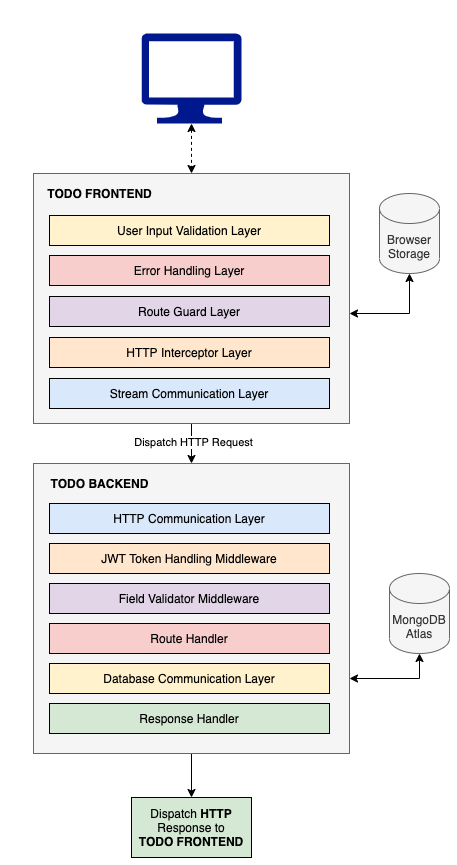

## :copyright: todo-app-backend
> _Demonstration of Todo application behavior by using Restful APIs._

## :book: Table of Contents
   <!-- START doctoc generated TOC please keep comment here to allow auto update -->
   <!-- DON'T EDIT THIS SECTION, INSTEAD RE-RUN doctoc TO UPDATE -->

- [System Diagram](#sparkles-system-diagram)
- [Prerequisites](#sparkles-prerequisites)
- [Getting started](#sparkles-getting-started)
- [How to use](#sparkles-how-to-use)
- [Deployment](#sparkles-deployment)
- [API Documentation](#sparkles-api-documentation)
- [Technologies](#sparkles-technologies)
- [License](#sparkles-license)

   <!-- END doctoc generated TOC please keep comment here to allow auto update -->

## :sparkles: System Diagram



## :sparkles: Prerequisites

Proceed with next steps if your platform meet following prerequisites.

- Install [Node.js](https://nodejs.org/en/) (14.16.0 LTS) on your device.

## :sparkles: Getting Started
Run the following command under `todo-app-backend` directory to install dependencies.
 ```
 npm install
 ```

## :sparkles: How to Use

Here is the list of tasks available out of the box and run these via `npm run <task>`.
 ```
   start             Run the build task and mount index file in dist directory
   clean             Cleans dist directory
   lint              Run Code quality operations 
   build             Perform npm and build
   watch             Watches file changes in Development mode
   test              Execute test blocks based on the configurations
   test:watch        Execute tests in watch mode
   test:coverage     Executes tests and generate coverage report
 ```

## :sparkles: Deployment
Run the following command on browsers with HTTPS to direct access to application resources.
 ```
 https://prod-todo.brilliant-apps.club/v1/api/
 ```

## :sparkles: API Documentation
Run the following command on browsers to see API documentation.
 ```
 https://prod-todo.brliiant-apps.club/api-docs
 ```

## :sparkles: Technologies

Usage          	            | Technology
 --------------------------	| --------------------------
Language        | JavaScript
Framework     	| Express
Database | MongoDB
Authentication | JWT
Transpiler           	| Babel
Documentation        	| Swagger
Test Framework | Jest
Code Quality Tools         	| ES Lint
Dependency Registries      	| NPM

## :sparkles: License

Todo API Backend is MIT licensed. Please refer LICENSE for more information.
